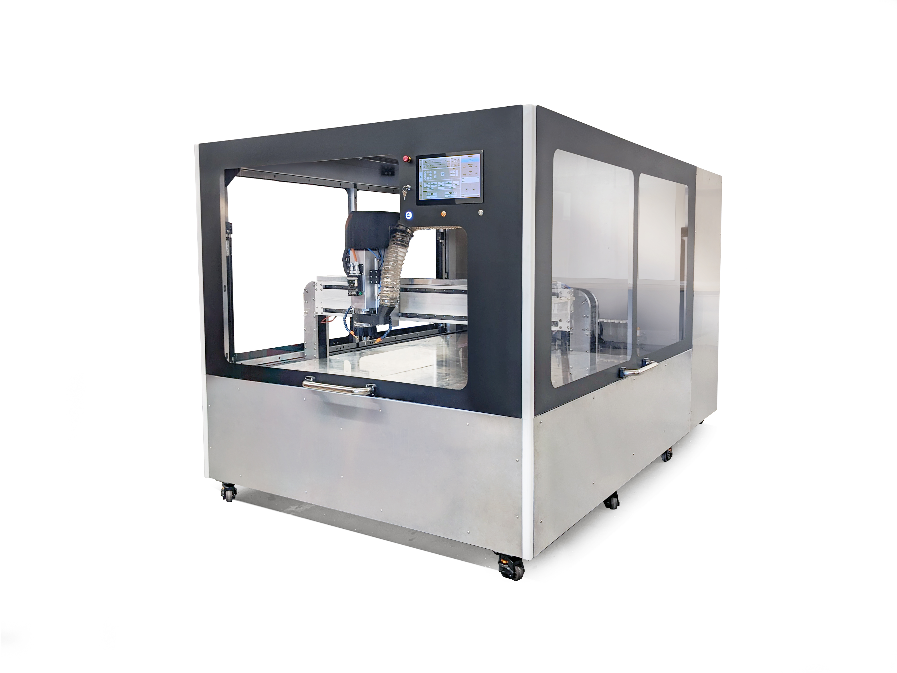

<h1 style=align="center">OLSK Large CNC V3</h1>

<i>Open Source CNC Milling machine - Large version - Open Lab Starter Kit</i>

 

Introduction
--
The OLSK Large CNC is an open source large format CNC milling machine, with a milling area of 2500 x 1250 mm. This large scale machine has an industrial design with a structure entirely made of standard beams and an integrated pneumatic system. It features an automatic tool changer with capacity for 14 tools, tool sensor, tool cleaning, pneumatic coupling and 4.5 KW spindle.

Specifications V2
--

- milling area: 2500 x 1250 mm
- frame: aluminum beams
- housing: fully enclosed with 3 accessible sides
- motion: ball screws on all axis with rotating nuts on Y axis
- motors: AC servo motors
- homing with inductive sensors
- industrial electronic system
- safe power setup with contactors, residual current device and circuit breakers

Files
--
- **[Assembly manual](https://open-lab-starter-kit.github.io/OLSK-Large-CNC/)**
- **[Wiring Schematic](OLSK_Large_CNC_WiringSchematic_V3.pdf)**
- **[Pneumatics Schematic](OLSK_Large_CNC_PneumaticsSchematic_V3.pdf)**
- **[BOM](BOM)**

Author
--

OLSK Large CNC has been designed and built by **[InMachines Ingrassia GmbH](https://www.inmachines.net/)**.

 

Machine design:
- **[Daniele Ingrassia](https://www.linkedin.com/in/danieleingrassia/)**

The machine is part of the **[Open Lab Starter Kit (OLSK)](https://www.inmachines.net/open-lab-starter-kit)** group of open source digital fabrication machines.

OLSK is developed by **[InMachines Ingrassia GmbH](https://www.inmachines.net/)** for the **[Dtec project](https://dtecbw.de/home/forschung/hsu/projekt-fabcity)** at **[Fab City Hamburg](https://www.fabcity.hamburg/en/)**.

OLSK Partners:
  

Contact
--

- daniele@inmachines.net
- [https://www.inmachines.net/](https://www.inmachines.net/)

License
--

Hardware design, CAD and PCB files, BOM, settings and other technical or design files are released under the following license:

- CERN Open Hardware Licence Version 2 Weakly Reciprocal - **[CERN-OHL-W](LICENSE_CERN_OHL_W_V2.txt)**

Assembly manual, pictures, videos, presentations, description text and other type of media are released under the following license:

- Creative-Commons-Attribution-ShareAlike 4.0 International - **[CC BY-SA 4.0](LICENSE_CC_BY_SA_4.0.txt)**
