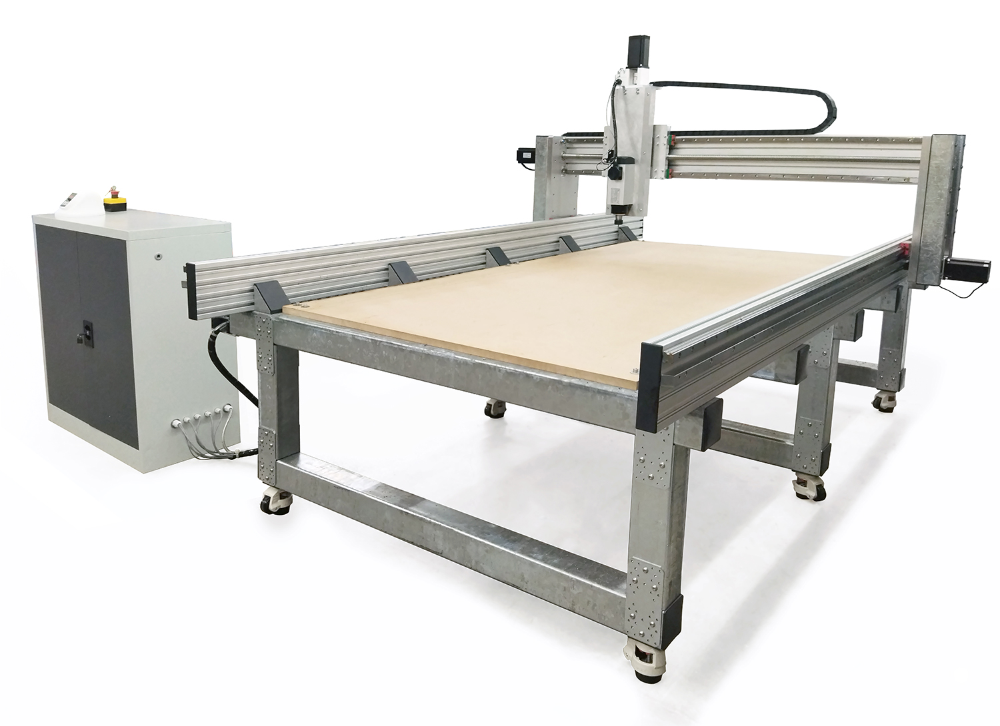
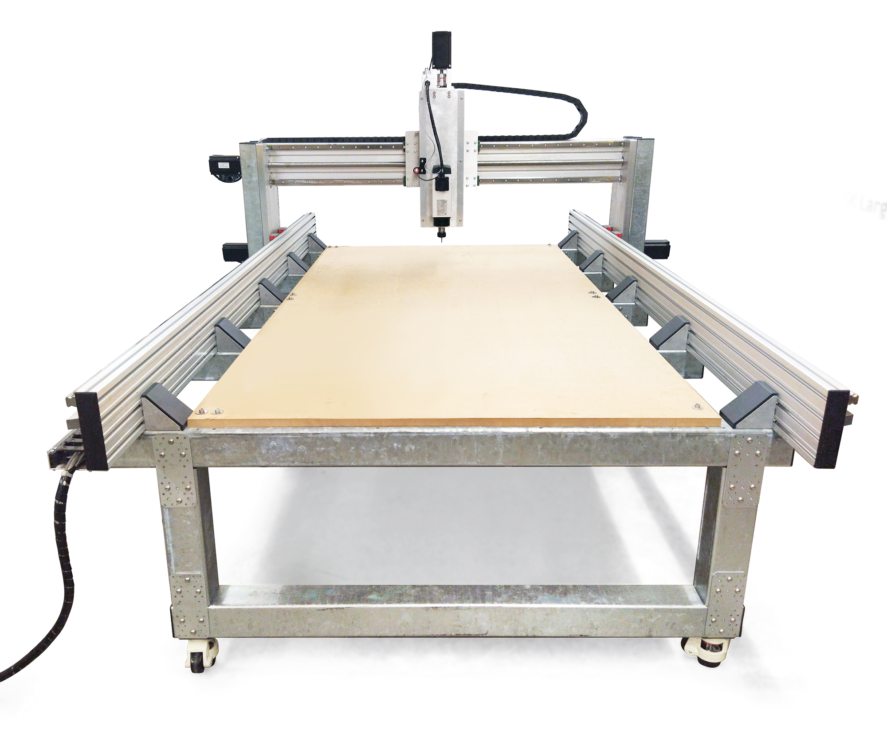
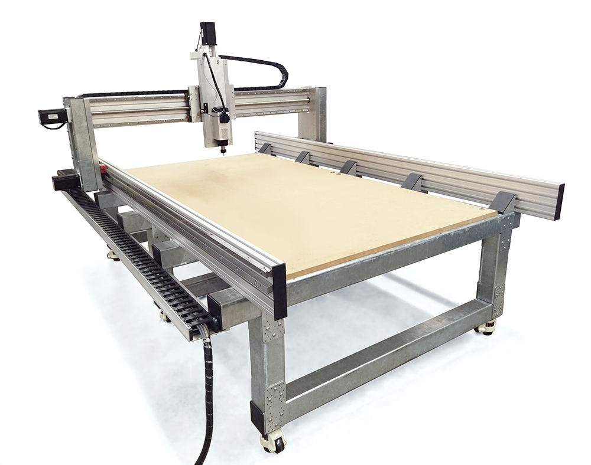

<h1 style=align="center">OLSK Large CNC V1</h1>

<i>Open Source CNC Milling machine - Large version - Open Lab Starter Kit</i>

 

Introduction
--
The OLSK Large CNC is a low-cost open source large format CNC milling machine, with milling volume of 2500 x 1250 x 300 mm. Designed to be easy to produce and assemble, this machine has a simpliflied structure combining steel pipes with aluminum parts. It can be replicable in most Fab Labs and also industrially, making use of accessible standard components and custom made fabricable parts. It has the highest open source Z-axis for milling machines and features a compact distance between the router and the linear guides, which provides a stable milling, in addition to the rack and pinion Y-axis. The machine can be easily moved and fixed with its retractable and adjustable wheels and an independent control box, which can operate with 220v, making it accessible for buildings with no 380v plower plug. 

The Assembly Workbook
--

All OLSK machines are open source and have the BOM and necessary files available in this repository for replication. The assembly of parts is also documented in a workbook where each step contains a list of parts, tools and instruction remarks, following a logic order to provide a smooth assembly.

Specifications V1
--

- milling volume: 2500 x 1250 x 300 mm
- frame: mix of steel pipes, CNC milled solid auminum and profiles
- motion: ball screws 25mm, rack and pinion
- guides: 25mm linear rails
- motors: stepper motor NEMA 34
- spindle cooling system: air
- homing with inductive sensors
- retractable wheels with adjustable height
- independent control box
- operates with 220v
- modular power system
- safe power setup with contactors, residual current device and circuit breakers
- Z height tool sensor

Files
--
- **[CAD](cad)**
- **[Converter PCB](converterPCB)**
- **[Assembly Workbook](OLSK_Large_CNC_V1_Workbook.pdf)**
- **[Wiring Schematic](OLSK_Large_CNC_V1_Wiring_Schematic.pdf)**
- **[BOM](BOM)**

Author
--

OLSK Large CNC has been designed and built by **[InMachines Ingrassia GmbH](https://www.inmachines.net/)**.

 

Machine design:
- **[Daniele Ingrassia](https://www.linkedin.com/in/danieleingrassia/)**

The machine is part of the **[Open Lab Starter Kit (OLSK)](https://www.inmachines.net/open-lab-starter-kit)** group of open source digital fabrication machines.

OLSK is developed by **[InMachines Ingrassia GmbH](https://www.inmachines.net/)** for the **[Dtec project](https://dtecbw.de/home/forschung/hsu/projekt-fabcity)** at **[Fab City Hamburg](https://www.fabcity.hamburg/en/)**.

OLSK Partners:
  

Contact
--

- daniele@inmachines.net
- [https://www.inmachines.net/](https://www.inmachines.net/)

License
--

Hardware design, CAD and PCB files, BOM, settings and other technical or design files are released under the following license:

- CERN Open Hardware Licence Version 2 Weakly Reciprocal - **[CERN-OHL-W](LICENSE_CERN_OHL_W_V2.txt)**

Assembly manual, pictures, videos, presentations, description text and other type of media are released under the following license:

- Creative-Commons-Attribution-ShareAlike 4.0 International - **[CC BY-SA 4.0](LICENSE_CC_BY_SA_4.0.txt)**
